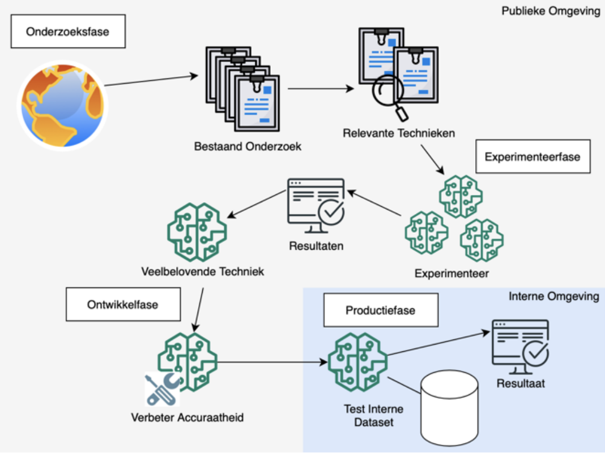
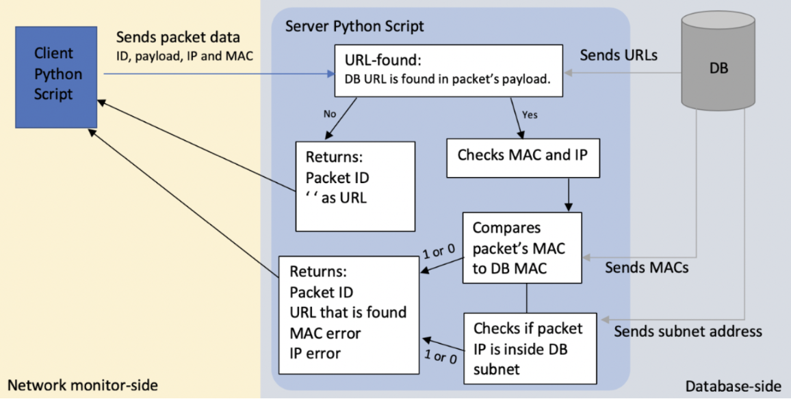

# Kia Ora! I'm Jacintha Walters
**Cybersecurity & AI Professional | Green List Tier 1 Eligible**

Hands-on IT professional with a strong academic background (MSc & BSc Cum Laude) and 2+ years of experience spanning security architecture, risk assessments, and secure NLP/ML pipelines. Known for bridging the gap between deep technical implementation, compliance frameworks, and executive stakeholder communication.

* 🎯 **Visa Status:** Valid New Zealand Working Holiday Visa (Full Work Rights)
* 💼 **Target Pathways:** Green List Tier 1 (Straight to Residence) — ICT Security Specialist / AI Software Engineer
* 📍 **Availability:** Immediate relocation to New Zealand from Europe possible

---

## 🛠️ Technical Expertise
* **Cybersecurity:** information security, network security, incident response, risk assessment, security frameworks (NIST), vulnerability analysis, secure development, container security, Internet of Things, IAM, MFA, governance
* **Artificial Intelligence:** Machine learning (scikit-learn), deep learning, computer vision (YOLO), NLP (spaCy), responsible AI, governance, EU AI Act, ChatGPT, Gemini
* **Programming Languages:** Python, Java, JavaScript, C++, containerisation (Docker), SQL
* **Cloud & Infrastructure:** Cloud architecture, AWS ecosystem
* **Communication & Leadership:** public speaking, stakeholder communication, curriculum design, technical documentation

---

## 🚀 Featured Engineering Projects & Case Studies

### 1. Secure MLOps NLP Pipeline: Adaptive Text Complexity Engine (Linguall)
*Production-ready containerised microservice automating dynamic text profiling to be used in a language learning app.*
* **Core Tech:** FastAPI, Docker, SpaCy, Pydantic, Textstat, Regex Guardrails
* **Security Controls:** Mitigates OWASP LLM01 Prompt Injections and OWASP top 10 via runtime sanitisation; enforces header-based IAM token verification.
* 🔗 **[View Repository & Source Code](https://github.com)**

---

### 2. Peer-Reviewed Publication: Enterprise AI Governance Framework (EU AI Act)
*First-Author research translating emerging European Union Artificial Intelligence Act regulations into actionable organizational maturity assessments.*
* **Core Focus:** AI Governance, Regulatory Compliance, Data Safety, Responsible AI, Risk Management
* **Publication Details:** J. Walters, D. Dey, D. Bhaumik, S. Horsman (Amsterdam University of Applied Sciences). Published 14-07-2023. Self-published and later indexed in **Springer’s "Artificial Intelligence: ECAI 2023 International Workshops"**.
* **Impact:** Selected by the university for multiple international conference keynotes (including ECAI 2023 in Krakow). **Cited 42 times** by global researchers.
* 🔗 **[View Scientific Paper on arXiv](https://arxiv.org)**

#### 💡 Abstract and Engineering Methodology
Organisations adopting Artificial Intelligence face massive challenges aligning deep learning models with data privacy laws and compliance frameworks. My master's research aimed at bridging this gap by focusing on how organisations can assess and improve their readiness for compliance with the AIA:
* **Maturity Modeling:** Translated abstract regulatory requirements into practical, structured auditing frameworks that evaluate AI transparency, accountability, and mitigation of algorithmic bias, resulting in a **compliancy score**.
* **Risk Auditing & Data Analysis:** Processed and analysed quantitative and qualitative research data to identify patterns and evaluate challenges related to AI governance.
* **Proof-of-Concept LLM Development:** Engineered a Large Language Model (LLM) chatbot to allow smaller organisations to interactively explore the new legislation and their current weaknesses.
---

### 3. Machine Learning Framework for Threat Intelligence (Dutch National Police)
*Applied specialized Machine Learning and Data Engineering pipelines to automate threat detection and optimize national web safety.*
* **Core Tech:** Python, Scikit-Learn, Pandas, NumPy, Machine Learning Pipelines
* **Classification:** Classified Government Ecosystem (Specific operational details and data implementations are strictly confidential)

#### 💡 Architectural Focus and Methodology
Working within a high-security government environment for the Dutch National Police, I developed a proof-of-concept predictive framework to improve web safety monitoring:
* **Data Engineering & Feature Analysis:** Designed data preprocessing loops to securely ingest, clean, and prepare unstructured intelligence data. Performed exploratory data analysis to evaluate feature distributions and ensure high data quality.
* **Model Selection & Optimization:** Benchmarked and compared multiple core machine learning algorithms, including explainable models like Support Vector Machines (SVM) and Naive Bayes, to determine the most effective classification approach.
* **Pipeline Refinement:** Built full train-test-evaluate pipelines, interpreting complex model performance metrics and refining the model through several iterations.

*Note: The structural framework diagram above is from the original documentation delivered to the Dutch National Police (translated overview: Research Phase -> Experimenting Phase -> Development Phase -> Production Phase).*

---

### 4. Deep Packet Inspection & Custom Intrusion Detection (IDS) Lab
*Low-level network security protocol parser designed from scratch to enforce zero-trust filtering and secure subnet boundaries.*
* **Core Focus:** Python, Socket Programming, IAM, Relational Databases, Network Monitoring

#### 💡 Engineering Implementation
To gain a foundational, bit-level understanding of network routing and security boundaries without relying on high-level abstraction libraries, I engineered a custom network monitoring processor simulated for an e-commerce infrastructure environment:
* **Bit-Stream Parsing:** Utilized Python's `struct.unpack` framework to map raw network packets, programmatically unpacking layered network headers directly from the binary payload stream to search for URLs and map this against white-listed URLs kept in a database.
* **Access Control & Threat Detection:** Implemented multi-factor validation logic to verify connection attempts based on destination URL, network location, and authorized MAC/device addresses, automating real-time administrator security alerts upon detection.

---

## ☕ More About Me
When I am not analysing for vulnerabilities or training AI pipelines, you can usually find me:
* 🍳 **Cooking traditional European dishes** and sourcing fresh, seasonal ingredients directly from local organic farmers. I am already looking forward to exploring New Zealand's local markets!
* ☕ **Working on my YouTube channel!** I have a channel with currently **15,000+ subscribers and 900,000+ views** where I share videos about my travel experiences and day-to-day life!
* 🇪🇺 **Polyglot in training:** Native in Dutch, fluent in English (C2), and currently maintaining an intermediate (B1) level in German. 

